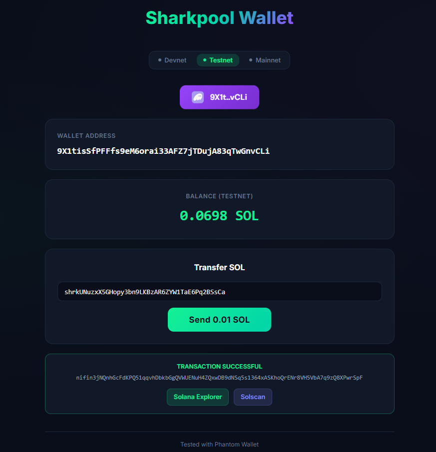

# Exercise 09 - Sharkpool Wallet

## Task

Create a simple frontend application that allows users to connect their Solana wallet, view their balance, and send SOL to any address.



## Features

- **Connect wallet** via Phantom or any Solana-compatible browser wallet
- **Display wallet address** and **SOL balance** (auto-refreshes every 5s)
- **Network selector** — switch between Devnet, Testnet, and Mainnet (balance updates dynamically)
- **Custom recipient** — enter any Solana address to send to
- **Send 0.01 SOL** with one click
- **Transaction explorer links** — view TX on Solana Explorer and Solscan (network-aware)
- **42 Blockchain branding** — logo in top-left corner and browser tab

## Stack

- React + TypeScript + Vite
- `@solana/web3.js` v1
- `@solana/wallet-adapter-react` + `@solana/wallet-adapter-react-ui`

## Run

```bash
npm install
npm run dev
```

Open http://localhost:5173 in your browser.

## Usage

1. Make sure Phantom is set to the correct network (Settings > Developer Settings > Testnet Mode)
2. Click **Select Wallet** to connect
3. Switch between Devnet / Testnet / Mainnet — balance updates automatically
4. Enter a recipient address and click **Send 0.01 SOL**
5. After confirmation, click the explorer links to view the transaction

> Tested with Phantom Wallet
