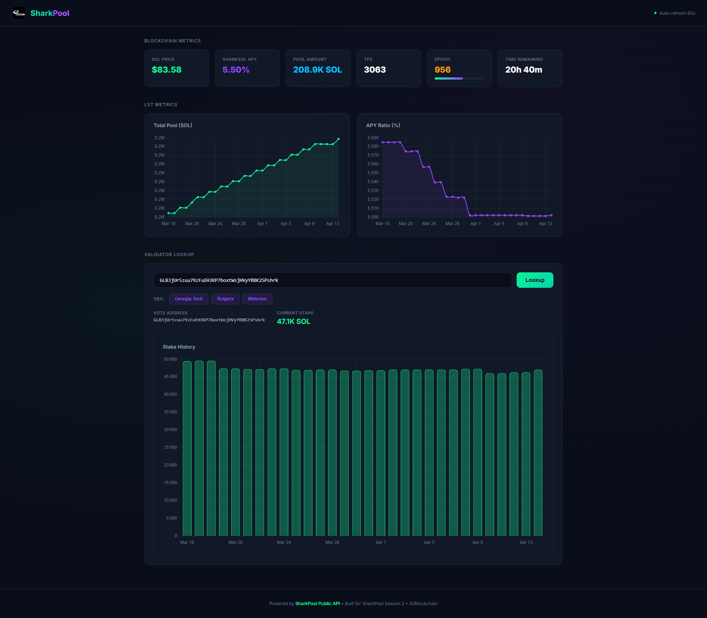

# Special Quest - SharkPool Dashboard

A React dashboard displaying live data from the [SharkPool Public API](https://public-api.sharkpool.org).



## Features

- **Live Blockchain Metrics**: SOL price, sharkSOL APY, pool amount, TPS, epoch progress with animated bar, time remaining
- **LST Metrics Charts**: Interactive line charts for Total Pool (SOL) and APY Ratio over the last 30 records
- **Validator Lookup**: Search any SharkPool validator by vote address to see current stake and stake history bar chart
- **Example Buttons**: Pre-filled validators (Georgia Tech, Rutgers, Waterloo) to test lookup quickly
- **Auto-refresh**: Metrics and LST data refresh every 60 seconds with a live pulsing indicator
- **Responsive**: Works on desktop and mobile
- **42 Blockchain branding**: Logo in header + browser tab favicon

## Architecture

```
src/
  types/api.ts              # TypeScript interfaces for API responses
  hooks/useApi.ts           # Custom hooks: useMetrics, useLstMetrics, useValidatorLookup
  components/
    MetricsGrid.tsx         # Blockchain metrics cards
    LstCharts.tsx           # Total Pool + APY Ratio line charts
    ValidatorLookup.tsx     # Validator search with stake history bar chart
  App.tsx                   # Main layout (header, main, footer)
  App.css                   # Dashboard styles
  index.css                 # Global styles + CSS variables
```

## Stack

- React 18 + TypeScript + Vite
- [Chart.js](https://www.chartjs.org/) + [react-chartjs-2](https://react-chartjs-2.js.org/)
- Vite dev proxy for the SharkPool API (the public API has no CORS headers)

## API Endpoints Used

| Endpoint | Purpose |
|----------|---------|
| `GET /metrics` | SOL price, TPS, sharkSOL APY, pool amount, epoch progress, time remaining |
| `GET /lst/metrics` | Last 30 LST records (total lamports, APY ratio) for the charts |
| `GET /validators/vote/{addr}/stake` | Current stake + stake history for a given validator |

Rate limit: 1 req/s, 45 req/min

## Run

```bash
npm install
npm run dev
```

Open http://localhost:5173

## Build

```bash
npm run build
```
